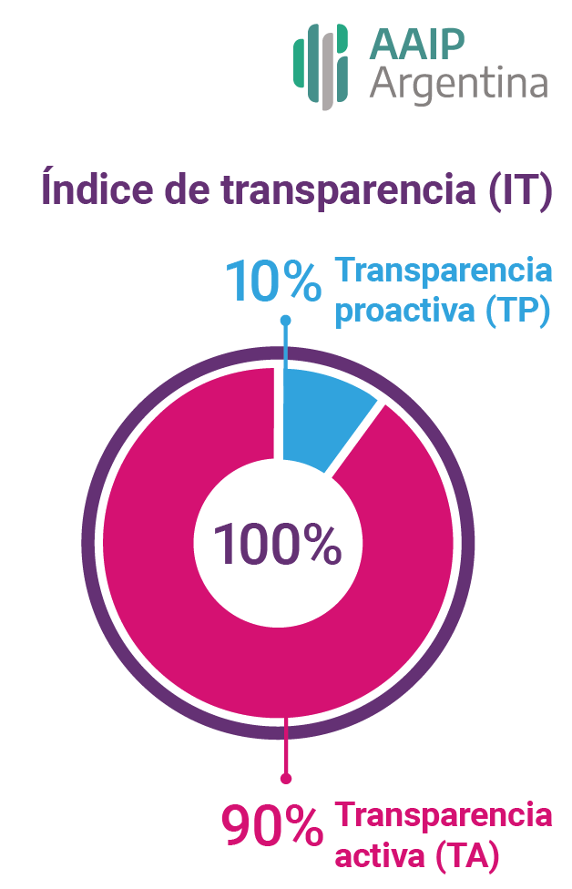

[La Agencia de Acceso a la Información Pública (AAIP)](https://www.argentina.gob.ar/aaip) es el organismo encargado de promover y supervisar la implementación de la Ley de Acceso a la Información Pública en Argentina. Dentro de la agencia, la [Dirección Nacional de Evaluación de Políticas de Transparencia (DNEPT)](https://www.argentina.gob.ar/aaip/autoridades/dnept) se dedica al seguimiento del cumplimiento del artículo 32 Transparencia Activa en más de 200 instituciones del sector público nacional argentino.

:::: {.columns}

::: {.column width="70%"}
Uno de los instrumentos centrales que utiliza la AAIP para desarrollar esta tarea es el [Índice de Transparencia](https://www.argentina.gob.ar/aaip/transparenciayparticipacion/indice-de-transparencia), que se construye año a año a partir de un relevamiento detallado de las pestañas de transparencia de los organismos. Este índice permite evaluar y comparar el desempeño de organismos públicos en términos de publicación activa y proactiva de información, calidad de sus portales, y cumplimiento de las obligaciones legales.

:::

::: {.column width="30%"}
{width=130}
:::

::::

Hasta 2024, el equipo de la DNEPT procesaba los datos del índice de manera semimanual. Si bien ya utilizaban R y el trabajo era riguroso, implicaba una gran carga operativa: revisar tablas, calcular puntajes y armar cientos de reportes de forma individual, cada uno dirigido a una institución específica.
Con la necesidad de automatizar ese proceso y garantizar su sostenibilidad en el tiempo, la AAIP se puso en contacto con [Estación R](https://estacion-r.com/). Juntas, nos propusimos diseñar una solución técnica robusta que permitiera al equipo hacer más, con mayor claridad y en menos tiempo y qué mejor que R para este desafío.

Trabajando en conjunto, desarrollamos un flujo de trabajo reproducible en R que permitió:

&nbsp;&nbsp;&nbsp;&nbsp;&nbsp;ꪜ **Validar** y **limpiar** automáticamente los datos recolectados del relevamiento.

&nbsp;&nbsp;&nbsp;&nbsp;&nbsp;ꪜ Calcular el índice completo con **trazabilidad** y **transparencia**.

&nbsp;&nbsp;&nbsp;&nbsp;&nbsp;ꪜ Generar de forma automática más de **200 reportes** en PDF personalizados, listos para ser enviados a cada institución evaluada.

&nbsp;&nbsp;&nbsp;&nbsp;&nbsp;ꪜ **Documentar** cada paso en un proyecto de RStudio versionado en GitLab, garantizando que el sistema pueda mantenerse y **reutilizarse** año a año.

&nbsp;&nbsp;&nbsp;&nbsp;&nbsp;ꪜ Brindar una **capacitación** técnica al equipo de la DNEPT sobre procesamiento de datos con R con foco en la sostenibilidad del flujo de trabajo.

&nbsp;&nbsp;&nbsp;&nbsp;&nbsp;ꪜ Ofrecer autonomía al equipo para que pueda **modificar** y **mejorar** el sistema en el futuro, sin dependencias.

Uno de los principales desafíos del proyecto fue lograr que un flujo de datos complejo, pero con estructura repetitiva, pudiera ser automatizado sin perder flexibilidad. La generación masiva de reportes era una necesidad urgente, pero no podía resolverse solo con plantillas: cada documento debía mostrar resultados claros, adaptados a cada institución y con visualizaciones comprensibles.

:::: {.columns}

::: {.column width="70%"}
En conjunto, diseñamos los reportes con un enfoque visual que permitiera, de un vistazo, entender el desempeño institucional. Gráficos de barras, comparaciones con el promedio nacional y tablas intuitivas fueron claves para que cada organismo pudiera reflexionar sobre sus resultados y tomar decisiones para mejorar.
:::

::: {.column width="30%"}
{width=130}
:::

::::

Lo más valioso del proyecto fue que el equipo de la DNEPT no solo recibió un producto terminado, sino una herramienta propia, que ahora domina y puede mantener de manera autónoma.

Desde Estación R creemos que así deben ser las soluciones con datos: reproducibles, entendibles y útiles para quienes las usan todos los días.

 

*** 

¿Querés saber cómo podríamos ayudar a tu equipo a automatizar reportes, visualizar datos o construir dashboards interactivos con R?

📩 Escribinos a <pablotiscornia@estacion-r.com>.

Nos encanta pensar soluciones que hagan que el trabajo con datos sea más claro, más potente y más sostenible.

 

## 🎬 Detrás de escena: paquetes de R que usamos para llevar adelante el proyecto.

El proyecto que desarrollamos junto a la AAIP no solo se basó en buenas prácticas de programación y documentación, sino también en el uso inteligente de algunos de los paquetes más poderosos del ecosistema de R. A continuación te compartimos cuáles usamos y para qué, por si querés replicar algo similar en tu equipo.

***

> 📦 tidyverse:
Usamos los paquetes del tidyverse como columna vertebral del flujo de trabajo. Con dplyr, tidyr y ggplot2, procesamos y transformamos los datos, y generamos visualizaciones claras y adaptadas al análisis que requería el índice.

***

> 📦 readxl: 
Las bases originales venían en formato Excel. Este paquete nos permitió importar los archivos .xlsx de forma sencilla y limpia, sin perder formatos ni estructuras importantes.

***

> 📦 janitor: 
Una joyita para limpiar nombres de columnas y tablas rápidamente. Con funciones como clean_names() organizamos la información desde el comienzo para facilitar el procesamiento posterior.

***

> 📦 here: 
Para asegurar que el flujo de trabajo fuera reproducible y pudiera ejecutarse desde cualquier máquina sin necesidad de cambiar rutas a mano, usamos here() para gestionar rutas relativas dentro del proyecto.

***

> 📦 gt: 
La generación de reportes en PDF requería incluir tablas limpias, claras y profesionales. Usamos gt para construir tablas con buen diseño y formateo, listas para presentar.

***

> 📦 glue:
¿Querés generar 200 reportes con textos personalizados automáticamente? glue fue clave para combinar texto y variables dentro de los informes de forma dinámica y elegante.

***

> 📦 googlesheets4 y googledrive:
Parte del input y validación del índice pasaba por planillas colaborativas. Estos paquetes nos permitieron leer datos directamente desde Google Sheets y, si hacía falta, descargar insumos o guardar resultados en Google Drive.

En conjunto, estos paquetes nos permitieron construir un flujo robusto, eficiente y reutilizable. Lo mejor: son todos parte del ecosistema de software libre que promovemos desde Estación R.