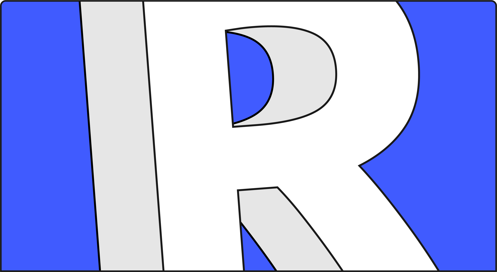
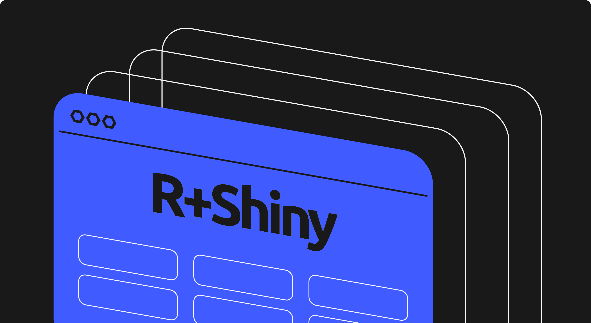
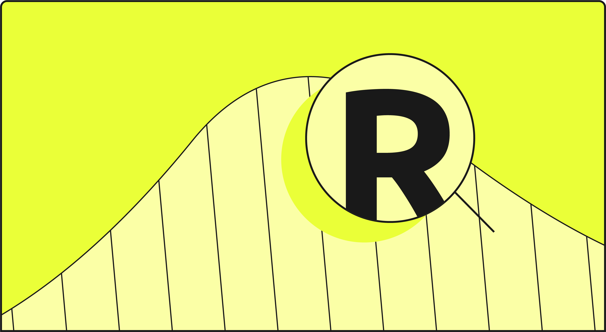
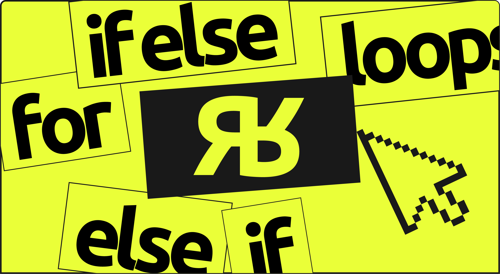
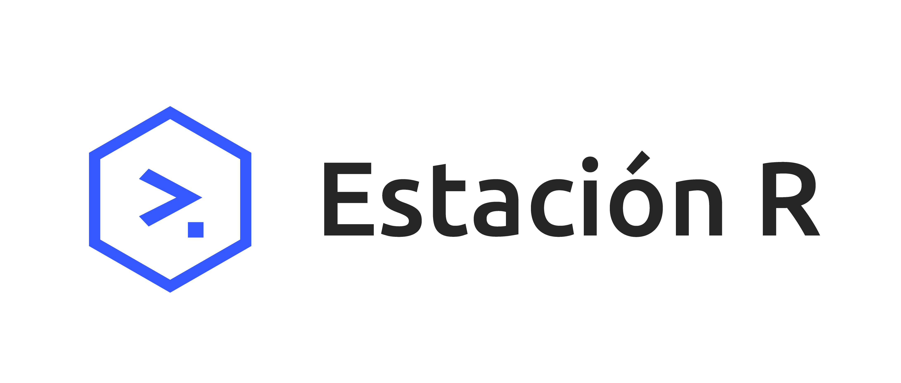

El fin de año siempre es una buena excusa para mirar hacia atrás, hacer balance y, sobre todo, celebrar el camino recorrido. En [Estación R](https://estacion-r.com), este 2025 ha sido un viaje increíble, lleno de nuevos desafíos, crecimiento y, lo más importante, mucha comunidad. Queremos compartir con ustedes todo lo que vivimos y construimos juntos.

## Fortaleciendo capacidades: La formación como motor de cambio

Una de nuestras misiones es llevar el poder de los datos a todos los rincones posibles. Este año, tuvimos el honor de capacitar al equipo de la **Dirección Nacional de Políticas de Acceso a la Información Pública**. Esta colaboración es fundamental para nosotros, ya que demuestra cómo R puede ser una herramienta clave para fortalecer nuestras instituciones y mejorar la transparencia.

Además, nuestros cursos insignia siguieron creciendo: **"Introducción al Procesamiento de Datos con R"** completó dos ediciones exitosas, consolidándose como la puerta de entrada para muchísimos profesionales al mundo de los datos. Y **"Introducción a Shiny"** también sumó dos ediciones más, acompañando a quienes quieren dar el salto hacia los dashboards interactivos.

:::: {.columns}

::: {.column width="50%"}
{width=90%}
:::

::: {.column width="50%"}
{width=90%}
:::

::::

## Ampliando horizontes: Nuevos cursos, nuevas posibilidades

Escuchar a nuestra comunidad es clave. Gracias a sus inquietudes y necesidades, este 2025 inauguramos **[cuatro cursos nuevos](https://estacion-r.com/courses)**, diseñados para llevar sus habilidades en R al siguiente nivel:

- **Dominando R: Potenciá tu Código** — Para quienes buscan escribir código más eficiente, robusto y profesional.

- **Introducción a la Visualización de Datos con R** — Porque comunicar con impacto es tan importante como analizar.

- **Mapas en acción: Análisis y Visualización Espacial con R** — Para explorar y contar historias a través de la geografía de los datos.

- **R para el tratamiento de Hojas de Cálculo** — Una respuesta directa para optimizar una de las tareas más comunes en el día a día.

:::: {.columns}

::: {.column width="50%"}
{width=90%}
:::

::: {.column width="50%"}
{width=90%}
:::

::::

Cada uno de estos cursos representa nuestro compromiso por ofrecer una formación cada vez más completa y especializada.

## Más que cursos, una comunidad activa

Creemos en el poder del conocimiento compartido. Por eso, junto a nuestro amigo y colega **[Cancu](https://www.linkedin.com/in/jcrodriguez1989/)** (Juan Cruz Rodríguez), creamos el **"Consultorio Abierto de R"**. Un espacio horizontal y colaborativo para resolver dudas, compartir ideas y seguir aprendiendo juntos.

El espíritu de comunidad también nos llevó a participar en eventos de talla internacional. Presentamos en **LatinR 2025** el trabajo que realizamos con la Agencia de Acceso a la Información Pública (AAIP), llevando nuestra experiencia local al escenario latinoamericano.

Además, nuestro director, **[Pablo Tiscornia](https://www.linkedin.com/in/ptiscornia/)**, está aportando su grano de arena como mentor en el prestigioso **[Programa Campeon(e|a)s de rOpenSci](https://ropensci.org/champions/)**, un pilar del ecosistema de software científico y de código abierto en R.

## Contenido constante para una comunidad curiosa

Mantenerse actualizado es fundamental. Por eso:

- Nuestro **[blog](https://estacion-r.com/blog)** siguió creciendo con series como *"Recursos Indispensables para Visualizar Datos con R"* ([Capítulo I](https://estacion-r.com/blog/87ed9382-b6cf-4091-987e-79acf17b5c49/rstats%20viz%20visualizacion%20datos%20ggplot2%20data-to-viz) y [Capítulo II](https://estacion-r.com/blog/d9b9abbb-d751-40f7-ba82-23a206aba6e1/rstats%20%20visualizacion%20%20graficos-r%20%20ggplot2%20%20graficos-estaticos%20%20graficos-interactivos%20%20paquetes-r%20%20data-viz)).

- Lanzamos nuestro **Newsletter semanal**, un resumen curado con lo más importante del universo R, acompañado de datos y curiosidades.

- En redes como **[LinkedIn](https://www.linkedin.com/company/estacion-r/)** y **[X](https://x.com/estaborrador_r)**, compartimos más de **+100 publicaciones** con tips, recursos y novedades para el día a día.

## Un equipo que crece y un compromiso que se renueva

Nada de esto sería posible sin las personas. Este año, repartimos más de **+20 becas** para asegurar que más gente pueda acceder a nuestras formaciones, sin importar su situación económica.

Y nuestro equipo docente creció en calidad humana y técnica con la incorporación de **[Elián Soutullo](https://www.linkedin.com/in/eli%C3%A1n-soutullo/)**, **[Tomás Bustos](https://www.linkedin.com/in/tomasbustos/)**, **[Luis Verde Arregoitia](https://www.linkedin.com/in/luis-d-verde-arregoitia-a20339209/)** y **[Federico Baraghian](https://www.linkedin.com/in/federico-baraghian/)**. Su experiencia, generosidad y conocimiento han enriquecido enormemente nuestro espacio. ¡Gracias infinitas a ellos!

## Mirando hacia el 2026

Este 2025 nos deja llenos de energía y con muchas ideas para lo que se viene. Ya estamos planificando un 2026 con más cursos, más actividades y más comunidad.

**¿Qué tenemos en mente?**

- Nuevas ediciones de los cursos que lanzamos en 2025

- Continuar con el exitoso **Consultorio Abierto de R**

- Y estamos trabajando en nuevas propuestas:
  - **R + Paquetes:** Creando tu propio paquete de R con... R
  - **R + IA:** Una aplicación práctica (y segura) de modelos LLM en tu flujo de datos
  - **Automatización de reportes con Quarto**

- ¿Un **podcast de R**? ¡Por qué no!

Pero no queremos hacerlo solos. Nos encantaría saber: **¿Qué te gustaría aprender o desarrollar con R el próximo año? ¿Hay algún tema que te quite el sueño o alguna herramienta que quieras dominar?**

 

***

Gracias por acompañarnos en este viaje. ¡Vamos por un 2026 con mucho más R!

{width=400}
